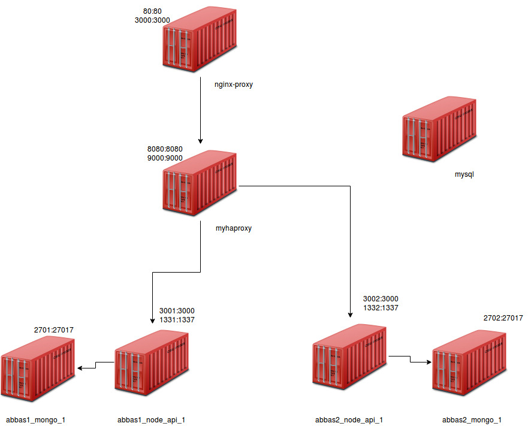

# nodepi_haproxy_nginx


this project aims to deploy 


1. NodeApi ( as much as instances as you want ) 
2. HaProxy 
3. Nginx ( proxy-server)
4. MySql




## Requirement:

vagrant >= 2.0.3

virtualbox >= 5.2.8

**note: it could work on earlier version but only tested on these version.**


## Usage:


clone the repo 

`git clone https://github.com/Abdelsalam-Abbas/nodepi_haproxy_nginx.git`

edit ansible-playbook variables per your needs, you can have 1 instance of node_api or 3 or even 20. 

```
abbas$ cat ansible_books/group_vars/all 
# ammount of nodeapi instances
count_of_instances: 3
project_prefix: "abbas"
```

start the deployment 

`vagrant up`

after deployment is complete you can test it by 

`
vagrant ssh -c "curl localhost"
`

